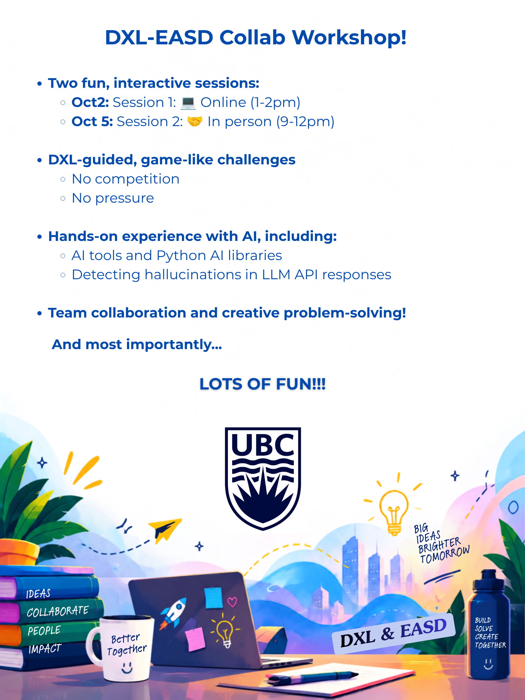
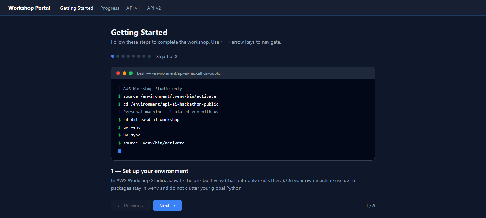
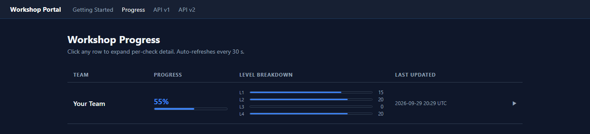
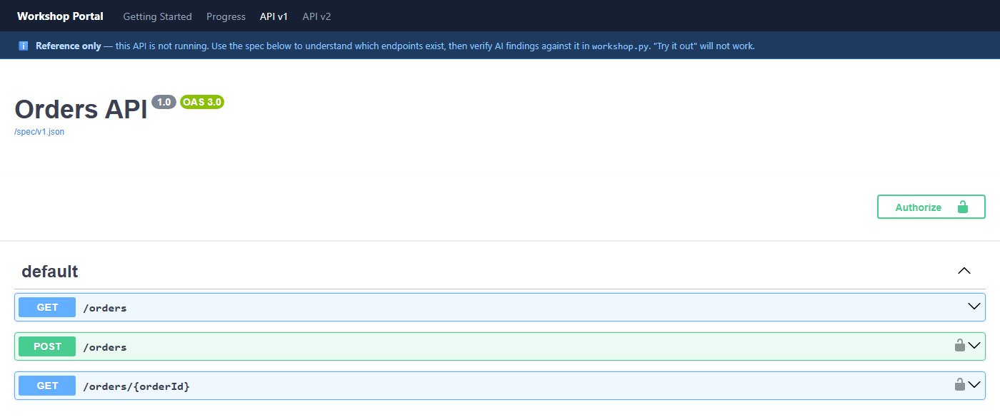

# API AI Workshop

<p align="center"></p>

**Start here.** This README is the only entry point for the workshop. Open it first, then follow **First 10 minutes**.

A workshop for API practitioners. Best if you already use AI for coding; the new skill is verification, not prompting.

You get a working but unreliable `api_hackathon/workshop.py`. Across four levels, you change it so only AI claims backed by the spec or the log survive.

Scoring uses pre-recorded AI answers with deliberate mistakes, so every team gets the same inputs and nothing needs the internet. The AI tutor, `python interact.py`, is where you explore each level: it uses a live model on Amazon Bedrock and needs your Workshop Studio credentials.

## Schedule

| Session | When (Pacific) |
|---|---|
| Online setup session | **Friday 2 October, 1:00–2:00 pm** |
| In-person workshop | **Monday 5 October, 9:00 am–12:00 pm** |

## Your role

You review work for a small Orders API team. Teammates used AI to draft four things, and each one may contain claims that sound right but are not true:

- **Level 1: contract review.** Findings about the OpenAPI spec, including endpoints that may not exist.
- **Level 2: test plan.** Negative tests, some aimed at routes or status codes the API does not have.
- **Level 3: incident thread.** A diagnosis that may cite log lines missing from the real log.
- **Level 4: migration note.** "Breaking changes" between two API versions, not all of them real.

Keep calling `ai.ask(...)`, because that is the untrusted draft. Return only what you can prove from the spec or the log. If a made-up claim slips through, people end up debugging a problem that never existed.

A related real-world case: AI-generated code can be syntactically valid and still be wrong because it ignores the team's framework conventions. Same habit applies — check the output against an authoritative source.

## First 10 minutes

Do these in order. When you finish, you have a running progress page and a first score.

1. Confirm Python 3.10+ (`python --version`). If Python is missing, install it from https://www.python.org/downloads/ and reopen the terminal.
2. Create an isolated environment with uv (see Install below) so workshop packages do not land in your global Python.
3. From the repo root, run `python portal.py` and leave that terminal open.
4. Your browser opens the Guide at `http://localhost:8081` — that is the on-screen activity script. If it does not open, paste that URL into your browser.
5. Open a second terminal, activate `.venv` again (see Install), then run `python score.py --team "Your Team" --open`. You should see about 55/100 on the unmodified starter.
6. Set your Workshop Studio credentials (see Install), then run `python interact.py` and pick Level 1. Activate `.venv` in that terminal first.

You are ready to edit Level 1 in `api_hackathon/workshop.py`.

## The workshop page

`python portal.py` starts a local page at `http://localhost:8081` and opens it in your browser. Keep it open while you work. It has four tabs:

**Getting Started:** a step-by-step guide to the whole activity. Use the arrow keys or Next to move through it.



**Progress:** your team's score for each level after every `score.py` run. Click a row for the detail of each check.



**API v1 and API v2:** the two Orders API specs in Swagger UI, so you can see which endpoints really exist.



## Install (uv)

Use [uv](https://docs.astral.sh/uv/) so dependencies stay inside `.venv` and do not clutter your global environment.

If you do not have uv yet:

```powershell
# Windows (PowerShell)
irm https://astral.sh/uv/install.ps1 | iex
```

```bash
# macOS / Linux
curl -LsSf https://astral.sh/uv/install.sh | sh
```

Then, from the repo root:

```powershell
uv venv
uv sync
```

Activate the venv in **each new terminal**. A second window does not inherit the first one.

```powershell
# Windows
.\.venv\Scripts\Activate.ps1
```

```bash
# macOS / Linux
source .venv/bin/activate
```

The prompt should show `(.venv)`. After that, `python` and `pip` use the isolated environment and will not install packages globally.

`interact.py` still needs Workshop Studio credentials in that same terminal. Paste them from Studio's **Get AWS CLI credentials** panel:

```powershell
# Windows (PowerShell)
$Env:AWS_DEFAULT_REGION="us-east-1"
$Env:AWS_ACCESS_KEY_ID="..."
$Env:AWS_SECRET_ACCESS_KEY="..."
$Env:AWS_SESSION_TOKEN="..."
```

```bash
# macOS / Linux
export AWS_DEFAULT_REGION="us-east-1"
export AWS_ACCESS_KEY_ID="..."
export AWS_SECRET_ACCESS_KEY="..."
export AWS_SESSION_TOKEN="..."
```

To persist those values inside this venv (so you do not re-export them every session), run:

```powershell
python scripts/pin_aws_creds.py
```

That appends the values to `.venv`'s activate script. Do not commit `.venv`.

```powershell
python portal.py
```

Then, with Studio credentials set in the same terminal:

```powershell
python interact.py
python score.py --team "Team One" --open
```

| URL | What you get |
|---|---|
| `http://localhost:8081` | Getting Started — activity walkthrough (Guide tab, opens automatically) |
| `http://localhost:8081/progress` | Progress page — click any row for per-check detail |
| `http://localhost:8081/api/v1` | Swagger UI for the Orders API v1 spec (reference only) |
| `http://localhost:8081/api/v2` | Swagger UI for the Orders API v2 spec (reference only) |

The Orders API is not running. Use Swagger to see which endpoints exist. "Try it out" will return 404.

`score.py` writes `report.html` after every run. Pass `--open` to open it automatically.

## Team setup

1. Join Workshop Studio with the join link your facilitator shares: **[WORKSHOP STUDIO JOIN LINK]**.
2. The AWS environment is available **Friday 2 October, 1:00 pm to Monday 5 October, 12:00 pm (Pacific)**. Studio CLI credentials last for that same window.
3. One teammate forks this repo. Everyone clones **the fork**, not this upstream repo.

**One person — create the fork** (GitHub UI: open the repo and click Fork, or use the CLI):

```powershell
gh repo fork UBCDigitalExperienceLab/dxl-easd-ai-workshop --clone=false
```

That creates `https://github.com/YOUR-ORG/dxl-easd-ai-workshop` where `YOUR-ORG` is **your GitHub username**. Invite teammates: Settings → Collaborators.

**Everyone — clone the fork** (replace `YOUR-ORG` with the fork owner's GitHub name, or copy the URL from the fork's green **Code** button):

```powershell
git clone https://github.com/YOUR-ORG/dxl-easd-ai-workshop.git
cd dxl-easd-ai-workshop
```

To clone into a different folder:

```powershell
git clone https://github.com/YOUR-ORG/dxl-easd-ai-workshop.git C:\path\to\your-team-folder
cd C:\path\to\your-team-folder
```
4. Studio VS Code is single-user. Edit on your own machine if needed. Download VS Code from https://code.visualstudio.com/download if you do not have it.
5. Share Studio CLI credentials so everyone can run activity scripts that call Bedrock (`interact.py`). Do not commit credentials.
6. On a personal machine you do not need `source /environment/.venv/bin/activate` — that path exists only in Studio. Use `uv venv` and `uv sync` from **Install** above.

Work on `main`. Push only `api_hackathon/workshop.py`.

## How to work each level

1. Run `python interact.py` and pick a level. Ask follow-up questions; the assistant will not give away the answer.
2. Use the Guide tab at `http://localhost:8081` as the on-screen activity script.
3. Edit the matching function in `api_hackathon/workshop.py`.
4. Check your progress as often as you like:

```powershell
python score.py --team "Your Team" --open
```

This scores your local `workshop.py`, opens a per-check report in your browser, and adds your team to the Progress tab at `http://localhost:8081/progress`. Scoring is only for your own visibility. It does not rank teams.

When you are done, push `api_hackathon/workshop.py` to your team fork. Facilitators review it there.

## Four levels

| Level | Task | Points |
|---|---|---:|
| 1 | Verify AI-generated OpenAPI findings and remove hallucinations | 20 |
| 2 | Turn AI test ideas into valid negative API tests | 25 |
| 3 | Verify a production incident diagnosis against the actual log file | 30 |
| 4 | Verify breaking API changes across two contracts | 25 |

Every level follows the same pattern: the AI produces output, your code checks it against the spec or the log, and only proven results survive. Edit only `api_hackathon/workshop.py`.

### Level 1 - Filter Hallucinated Contract Findings (20 pts)

The AI returns a list of OpenAPI findings. Some may point at parts of the spec that do not exist.

Keep only findings where:
1. The `path` and `method` actually exist in the spec
2. The `evidence_pointer` (a JSON Pointer like `/paths/~1orders/get`) resolves to a real location in the spec.
   Split the pointer on `/` first, then decode `~1` to `/` **inside that key**.
   `/paths/~1orders/get` means `spec["paths"]["/orders"]["get"]`, not `//orders`.

**Tip:** open `http://localhost:8081/api/v1` to browse the real spec in Swagger UI — it shows exactly which paths and methods exist. The API is not running, so "Try it out" won't work; use the spec as a reference only.

**Starter code behaviour:** returns every finding unchecked.

<details><summary>Stuck? Open a hint</summary>

The AI returns 4 findings and one is made up. It describes a path that is not in the v1 spec at all. Compare each finding's path with the paths Swagger lists.

</details>

### Level 2 - Filter Hallucinated Negative Tests (25 pts)

The AI proposes negative test cases. Some may not be valid tests for this API.

Keep only test cases where:
1. The `path` and `method` exist in the spec
2. The `expected_status` is one of `400`, `401`, `403`, `404`, `409`, or `422`
3. Every case has the required fields: `name`, `method`, `path`, `input`, `expected_status`

**Tip:** open `http://localhost:8081/api/v1` to see which routes exist before deciding which test cases are targeting real endpoints. The API is not running, so "Try it out" won't work; use the spec as a reference only.

**Starter code behaviour:** returns every test case unchecked.

<details><summary>Stuck? Open a hint</summary>

The AI proposes 4 test cases and one is invented. It targets a route that does not exist in v1.

</details>

### Level 3 - Incident Diagnosis (30 pts)

The AI returns candidate diagnoses for a production incident, each with the log lines it cites as evidence.

Return only the diagnosis where every item in its `evidence` array appears literally in the log text.

**Starter code behaviour:** picks the first diagnosis without checking it.

<details><summary>Stuck? Open a hint</summary>

There are 2 diagnoses. Only one cites evidence that appears word for word in `data/incident.log`, and it is not the first one. Search the log for each evidence string.

</details>

### Level 4 - Filter Hallucinated Breaking Changes (25 pts)

The AI reports breaking changes between v1 and v2. Not every claimed change is real.

Verify each claimed change by diffing the two specs directly:
- `operation_removed`: operation exists in v1, gone in v2 -- keep it
- `parameter_became_required`: parameter is optional in v1, required in v2 -- keep it
- `schema_changed`: schemas must actually differ between v1 and v2 -- if they are identical, reject the claim

**Tip:** open `http://localhost:8081/api/v1` and `http://localhost:8081/api/v2` side by side to visually spot what changed before writing the diff logic. The API is not running, so "Try it out" won't work; use the specs as a reference only.

**Starter code behaviour:** returns every claimed change unchecked.

<details><summary>Stuck? Open a hint</summary>

The AI reports 3 changes and one is invented. It claims a field changed type, but both specs define that field the same way. Compare the two schemas directly.

</details>

## Five-minute demonstration

1. Show one unreliable baseline result
2. Explain your verification approach
3. Run the progress check
4. Show one AI mistake your code catches
5. State where this pattern could help in daily API work

## Project map

```text
README.md                           start here
api_hackathon/workshop.py           participant implementation — the only file to edit
api_hackathon/ai.py                 fixture AI + Bedrock + optional Ollama adapters
data/                               synthetic specs, logs, and AI responses
interact.py                         interactive assistant (Bedrock)
score.py                            progress checks (always uses FixtureAI)
portal.py                           local progress page + Guide + Swagger (port 8081)
pyproject.toml                      uv dependencies (boto3)
demo.py                             run every level and print raw AI output
docs/online-session-slides.pdf      online setup session slides
```

All artifacts are synthetic. Do not replace them with production payloads, credentials, or confidential logs during the event.
